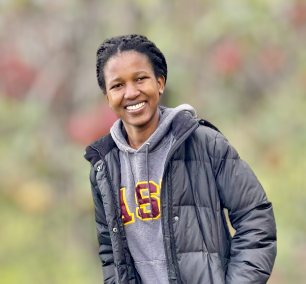

---

layout: default
title: "Home"
group: "navigation"

---
<!--  -->

<!--  -->

I am a Research Scientist at IBM Research in Cambridge, MA. I completed my PhD in Computer Science at Rensselaer Polytechnic Institute (RPI), where I was advised by <a href="https://www.cs.rpi.edu/~gittea/">Prof. Alex Gittens</a> in collaboration with <a href="https://moonfolk.github.io">Dr. Mikhail Yurochkin</a> and <a href="https://yuekai.github.io">Prof. Yuekai Sun</a>. Before RPI, I obtained a Bachelor’s degree in Software Engineering from Barrett, The Honors College at Arizona State University. During my studies, I did summer research internships at IBM Research and Microsoft Research.
 
<!-- My current research focuses on efficient techniques for alignment of foundation models. I am also interested in the out-of-distribution (OOD) generalization research and the applications of AI in solving real world problems. -->

<!-- Before joining RPI, I worked as a research intern at Microsoft Research in Redmond, Washington in Summer 2018, where I implemented a robust and scalable video processing engine that performed real-time image classification and labeling using a state-of-the-art deep neural network, and measured its performance. I received my BS in Software Engineering from Barrett, The Honors College at Arizona State University.
 -->
<!-- In summer 2020, I had the opportunity to intern at IBM Research in Yorktown Heights New York, where I used Machine Learning and Natural Language Processing techniques to determine how vulnerabilities will most likely be exploited and by who. -->
<!-- Outside of work and school, I like to hike, dance and listen to music. I also like to travel and to interact with people from different cultures!  -->

<!-- <b>Email:</b> lilianngweta@gmail.com  -->
I currently work on improving efficiency and reliability in AI agents.

 
## Updates! 

* March 2025: Our work on [prompt brittleness](https://aclanthology.org/2025.naacl-srw.51/) was accepted to NAACL SRW 2025! 

* Spring 2025: Graduated with a PhD in Computer Science from RPI!

* September 2024: Our [aligners](https://arxiv.org/pdf/2403.04224) paper has been accepted to EMNLP 2024 Findings!

<!-- * June 2024: A full-length preprint of our work [Aligners: Decoupling LLMs and Alignment](https://arxiv.org/abs/2403.04224) is now available! -->

<!-- * Summer 2024: Excited to intern with a team in the AI-powered Automation group at IBM Research led by [Dr. Yara Rizk](https://scholar.google.com/citations?user=llV-0hwAAAAJ&hl=en), mentored by [Dr. Jason Tsay](https://www.jsntsay.com/) and [Kiran Kate](https://www.linkedin.com/in/kiran-kate-8b98672/)! -->

* February 2024: Our work [Aligners: Decoupling LLMs and Alignment](https://openreview.net/forum?id=E6WukV41He&referrer=%5Bthe%20profile%20of%20Lilian%20Ngweta%5D(%2Fprofile%3Fid%3D~Lilian_Ngweta1)) got accepted as a tiny paper for an **oral presentation** at ICLR 2024!

<!-- * Summer 2023: Excited to return to IBM Research as a Research Extern this summer, mentored by <a href="https://moonfolk.github.io">Dr. Mikhail Yurochkin</a> and <a href="https://yuekai.github.io">Dr. Yuekai Sun</a>! -->

* April 2023: Our paper [Simple Disentanglement of Style and Content in Visual Representations](https://arxiv.org/abs/2302.09795) got accepted at ICML 2023!

<!-- * Summer 2022: Very privileged to work under the mentorship of <a href="https://moonfolk.github.io">Dr. Mikhail Yurochkin</a> and <a href="https://yuekai.github.io">Dr. Yuekai Sun</a> this summer as an IBM Research Extern! -->

<!-- * August 2022: Started working with <a href="https://www.cs.rpi.edu/~gittea/">Professor Alex Gittens</a> as my PhD advisor! -->

<!-- * May 2022: Started working with <a href="https://www.cs.rpi.edu/~gittea/">Professor Alex Gittens</a> as my PhD co-advisor!

* May 2021: Started working with <a href="https://sites.ecse.rpi.edu/~qji/">Professor Qiang Ji</a> as my PhD advisor!

* May 2021: Returned to IBM Research as a Research Intern!

* June 2020: Joining IBM Research as a Research Intern!

* May 2020: Finished my Computer Science PhD qualifiers!

* May 2020: Receiced my Master's degree in Computer Science from RPI! -->

