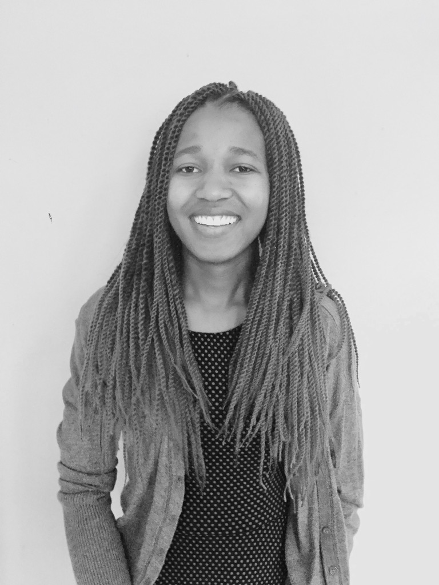

---

layout: default
title: "Home"
group: "navigation"

---

I am a Computer Science PhD student at Rensselaer Polytechnic Institute (RPI) in Troy, New York advised by <a href="https://www.cs.rpi.edu/~gittea/">Prof. Alex Gittens</a>. My research interests are in the areas of Causal Machine Learning and domain generalization/out-of-distribution (OOD) generalization. I am also interested in the applications of Machine Learning/AI methods to solve real world problems.

Before joining RPI, I worked as a research intern at Microsoft Research in Redmond, Washington in Summer 2018, where I implemented a robust and scalable video processing engine that performed real-time image classification and labeling using a state-of-the-art deep neural network, and measured its performance. I received my BS in Software Engineering from Barrett, The Honors College at Arizona State University.

In summer 2020, I had the opportunity to intern at IBM Research in Yorktown Heights New York, where I used Machine Learning and Natural Language Processing techniques to determine how vulnerabilities will most likely be exploited and by who.

Outside of work and school, I like to hike, dance and listen to music. I also like to travel and to interact with people from different cultures! 

<b>Email:</b> lilianngweta@gmail.com

 
## What's New? 

* Summer 2022: Very privileged to work under the mentorship of <a href="https://moonfolk.github.io">Dr. Mikhail Yurochkin</a> and <a href="https://yuekai.github.io">Dr. Yuekai Sun</a> this summer as an IBM Research Extern!

* August 2022: <a href="https://www.cs.rpi.edu/~gittea/">Professor Alex Gittens</a> became my PhD advisor!

* May 2022: Started working with <a href="https://www.cs.rpi.edu/~gittea/">Professor Alex Gittens</a> as my PhD co-advisor!

* May 2021: Started working with <a href="https://sites.ecse.rpi.edu/~qji/">Professor Qiang Ji</a> as my PhD advisor!

* May 2021: Returned to IBM Research as a Research Intern!

* June 2020: Joining IBM Research as a Machine Learning Research Intern!

* May 2020: Finished my Computer Science PhD qualifiers!

* May 2020: Receiced my Master's degree in Computer Science from RPI!

